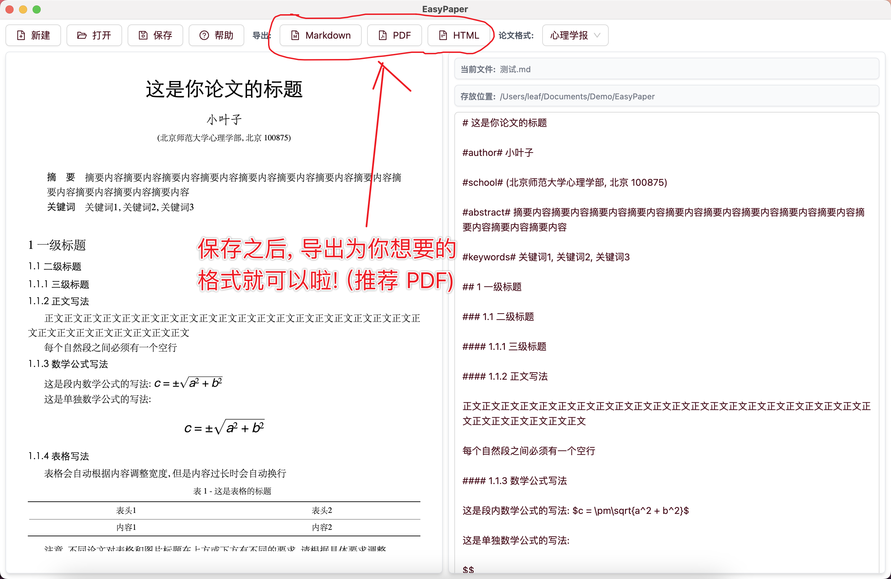

# EasyPaper

**初学者撰写学术论文的最简单方式**

## 前言

本软件旨在解决大学新生最头疼的问题之一: 调整论文格式, 帮助初学者更多地把精力放在写作本身上. 它基于十分简单的 Markdown 语法 (哪怕你没听过, 参考下面的示例也能马上上手), 通过图形界面实时预览, 并一键导出指定格式的学术论文

相比于 LaTeX, 本软件更加简单易用, 省去了复杂的配置和学习成本, 但仍然能够满足大部分学术论文的排版需求; 相比于 Word, 本软件完全接管了格式调整的工作, 你只需选择指定的论文模板 (目前仅支持心理学报格式), 专心写作即可

如果你有一定的计算机基础, 也推荐您使用命令行程序 [MarkdownPaper](https://github.com/LeafYeeXYZ/MarkdownPaper), 它的处理逻辑与本软件基本一致, 但更加灵活和强大 (如支持导出 DOCX 文件), 您还可以使用任何您喜欢的编辑器撰写学术论文

## 使用方法

**小红书视频示例**:


### 1 下载安装


> 由于作者没钱开通 `Apple Developer` 账号, 所以 `MacOS` 下可能提示软件已损坏, 请参见[这篇文章](https://www.mac2m.com/article/450/)修复; 如果您熟悉 `Node.js`, 也可自行构建, 参见 `package.json` 文件

### 2 新建文档


### 3 写论文

书写格式如下:

```markdown
# 这是你论文的标题

#author# 小叶子

#school# (北京师范大学心理学部, 北京 100875)

#abstract# 摘要内容摘要内容摘要内容摘要内容摘要内容摘要内容摘要内容摘要内容摘要内容摘要内容摘要内容摘要内容

#keywords# 关键词1, 关键词2, 关键词3

## 1 一级标题

### 1.1 二级标题

这是段内数学公式的写法: $c = \pm\sqrt{a^2 + b^2}$

这是单独数学公式的写法:

$$
c = \pm\sqrt{a^2 + b^2}
$$

#### 1.1.1 三级标题

正文正文正文正文正文正文正文正文正文正文正文正文正文正文正文正文正文正文正文正文正文正文正文正文正文正文正文正文

每个自然段之间必须有一个空行

#### 1.1.2 三级标题

这里是图片示例

将图片放在指定的文件夹下, 然后使用  插入图片


> 图 1 - 这是一张图

## 2 一级标题

这里是表格示例

表格会自动根据内容调整宽度, 但是内容过长时会自动换行

> 表 1 - 这是一张表

| 表头1 | 表头2 |
| :---: | :---: |
| 内容1 | 内容2 |

注意, 不同论文对表格和图片标题在上方或下方有不同的要求, 请根据具体要求调整

##### 参考文献

- 文献1
- 文献2
- 文献3

##### 附录

附录可以放图片、表格等等等等
```

> 数学公式语法详见 [https://katex.org](https://katex.org) 和[这篇中文文章](https://kissingfire123.github.io/2022/02/18_数学公式katex常用语法总结)

### 4 导出论文



## 未来展望

本软件的技术栈为 `Electron(Electron Vite)` + `React` + `TailwindCSS` + `Ant Design`; 如果您想参与开发新模板, 请在 `/lib/themes.ts` 中定义并导出类型为 `MarkdownPaperTheme` 的对象, 并在 `/lib/utils.ts` 导入并将其添加到 `THEMES` 数组中

- [ ] 支持更多的论文格式
- [x] 支持插入 LaTeX 公式
- [ ] 独立的参考文献管理
- [ ] AI 文章润色和参考文献查询 (基于本地 ollama)
